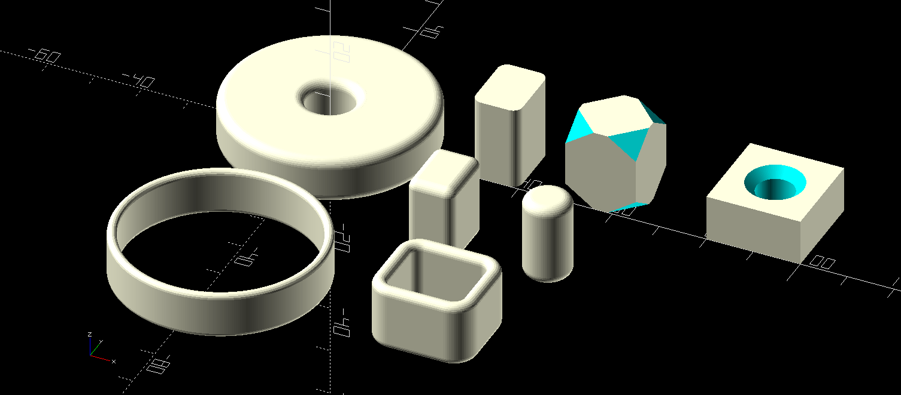

# OpenSCAD smooth primitives library

This library is a collection of some smooth primitives, i.e. having specified
rounded edges, for use in other designs.  It's not a comprehensive collection,
but a useful set.

* SmoothCylinder (two methods)
* HollowCylinder
* SmoothHole
* ChamferHole
* SmoothCube
* SmoothXYCube
* SmoothCorner
* SmoothWall
* SmoothHollowCube
* CutCorner
* CutCube

